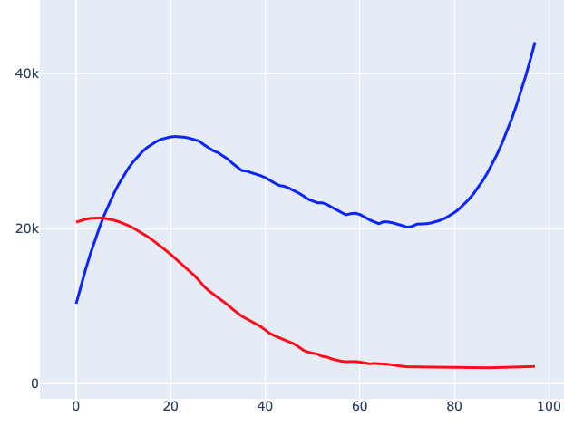
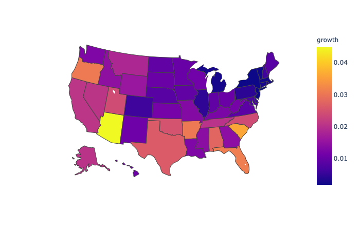
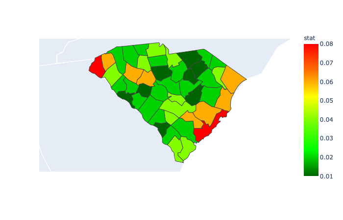
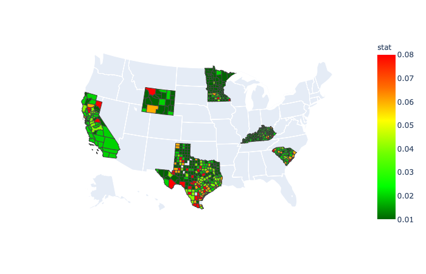

#### covid

This is a project to download and visualize the data collated by the [Johns Hopkins CSSE](https://github.com/CSSEGISandData/COVID-19) folks.

The script ``analysis.py`` should work for you on any Mac if you clone the project, since ``python`` is built-in.

Linux will work too.  Unfortunately, there will be path issues on Windows.  (I never use Windows, but I promise to work on that issue).

#### basic setup

Parsing the file structure depends on a ``base`` path, which is established by an environmental variable.  

In my ``~/.zshrc`` I have the lines:

    covid_base=$HOME'/Dropbox/Github/covid'
    export covid_base
    alias cov='cd $covid_base && pwd'
    
You could do this as a one-off in Terminal by entering just the first line

    covid_base=$HOME'/path/to/covid'
    
Then, in the scripts, one of the first things that usually happens is:

    import sys, os
    base = os.environ.get('covid_base')
    sys.path.insert(0,base)
    
From there, it all just works.

#### Run this at home

I'm using Python3 for this project.  I installed it with Homebrew.  Much of it *does* work with Python2, but there are a few wrinkles.

The tests module uses a particular ``subprocess`` method called ``run``, which requires Python3.  

Also, I installed ``plotly`` and ``pandas`` with pip3 (for python3).  These are needed for the choropleth maps.  I don't know if or how well they work with python2.

To test, I used the web interface to Github to clone the project by downloading a zipfile to my Desktop and then opened it.  The directory name is covid-master.  Then I set the environmental variable

    covid_base=$HOME"/Desktop/covid-master"

and everything seems to work from there.

#### Command line arguments

These can be viewed by running say, ``analyze.py`` with ``-h`` or ``--help``.

Features that are currently supported:

    > python3 analyze.py -h  
    
    flags
    -h  --help      help
    -n   <int>      display the last -n values, default: 7
    -N   <int>      display -N rows of data, default: all
    -c   <int>      --delta, change from x days ago, default: 1
    -u   <int>      data slice ends this many days before the current day 
    
    -a  --all       use the complete db, starting 2020-03-22 (default now)
    -d  --deaths    display deaths rather than cases (default)
    -f  --csv       format output as csv
    -o  --only      do not descend from US to states, or states to counties
    -p  --pop       normalize to population (disables totals)
    -q  --quiet     silence output (for tests)
    -r  --rate      compute statistics (over last 7 days)
    -s  --sort      
    -t  --totals    (only)
    -v  --verbose   debugging mode
    
        --no_dates  suppress dates in row 1
        --counties  show US by counties
        --average   running average (7 days)
    
    to do:
    
    -g  --graph     plot a graph of the data
    -m  --map       make a choropleth map
    
    example:
    > python3 analyze.py SC -n 3 -N 10 -sdr
                07/11 07/12 07/13  stat
    Orangeburg     21    21    25  0.09 
    Marion          9     9    10  0.054
    York           12    12    13  0.041
    Anderson       19    20    20  0.025
    Lexington      59    61    62  0.025
    Clarendon      45    46    47  0.022
    Lee            22    23    23  0.022
    Charleston     59    60    61  0.017
    Greenville    103   105   106  0.014
    Horry          72    73    73  0.007
    >

Rather than use the built-in Python module for parsing the command line arguments (I find it too complicated), I rolled my own, see ``uinit.py``.

The statistic is the slope of a linear regression, divided by the mean of the values.  

So, for example, if a 10-day series goes smoothly from 100 to 110, then the slope is about 10/10 = 1 and the statistic is a bit less than 0.01.  If the series goes from 1000 to 1100, then the slope is about 100/10 = 10, but the statistic is still approximately 0.01.

#### Examples (as of 2020-07-09)

Let's go through the flags one by one.

    > python3 analyze.py -N 2
	             07/03 07/04 07/05 07/06 07/07 07/08 07/09
	Afghanistan  32022 32324 32672 32951 33190 33384 33594
	Albania       2662  2752  2819  2893  2964  3038  3106

The ``-N`` flag takes an integer modifier, and it cuts the number of rows to that value.  Since we did not provide a search term, we get the world.

    > python3 analyze.py SC -N 4 -n 4
	           07/06 07/07 07/08 07/09
	Abbeville    124   135   134   137
	Aiken        507   516   530   545
	Allendale     61    64    64    64
	Anderson     777   798   824   886
	>

We search for ``SC`` (South Carolina), and we change the default number of columns from 7 to 4.

    > python3 analyze.py SC -N 4 -n 4 -f
	,07/06,07/07,07/08,07/09
	Abbeville,124,135,134,137
	Aiken,507,516,530,545
	Allendale,61,64,64,64
	Anderson,777,798,824,886
	>

The ``-f`` flag asks to format as csv.  This is most useful for plotting programs.

Here's the US states:

	> python3 analyze.py US -N 5 -n 5
	             07/05  07/06  07/07  07/08  07/09
	Alabama      42359  43450  44375  45263  46424
	Alaska        1107   1134   1162   1180   1222
	Arizona      94567  98103 101455 105094 108614
	Arkansas     22322  22907  23288  23598  24301
	California  252895 264681 271035 284012 292560


We can add totals (for the whole US) with ``-t``:

	> python3 analyze.py US -N 5 -n 5 -t
	              07/05   07/06   07/07   07/08   07/09
	Alabama       42359   43450   44375   45263   46424
	Alaska         1107    1134    1162    1180    1222
	Arizona       94567   98103  101455  105094  108614
	Arkansas      22322   22907   23288   23598   24301
	California   252895  264681  271035  284012  292560
	total       2820368 2868846 2916232 2974609 3032316
	>

The ``-o`` flag limits the output to just the US

	> python3 analyze.py US -N 5 -n 5 -o
	      07/05   07/06   07/07   07/08   07/09
	US  2820368 2868846 2916232 2974609 3032316
	>

The ``-p`` flag normalizes to population.  

Not all locations have the population entered so this may fail.  All the US states are there, as well as countries of the EU.

	> python3 analyze.py US -N 5 -n 5 -p
	            07/05 07/06 07/07 07/08 07/09
	Alabama       863   886   905   923   946
	Alaska        151   155   158   161   167
	Arizona      1299  1347  1393  1443  1492
	Arkansas      739   759   771   781   805
	California    640   669   685   718   740
	> 

The ``-r`` flag computes a statistic and is most useful combined with ``-s`` for sort:

	> python3 analyze.py US -N 5 -n 5 -rs
	             07/05  07/06  07/07  07/08  07/09   stat
	Idaho         7369   7732   8051   8538   8968  0.049
	Texas       192153 194932 205642 216026 224929  0.042
	Montana       1167   1212   1249   1327   1371  0.041
	Florida     189851 199885 206217 213563 223532  0.039
	California  252895 264681 271035 284012 292560  0.036
	>

But sort will work without ``-r``

	> python3 analyze.py US -N 5 -n 5 -s 
	             07/05  07/06  07/07  07/08  07/09
	New York    396598 397131 397649 398237 398929
	California  252895 264681 271035 284012 292560
	Texas       192153 194932 205642 216026 224929
	Florida     189851 199885 206217 213563 223532
	New Jersey  172354 172717 172916 173196 173383
	>

We can use the ``-c`` flag to show the change from a previous time.  Most often, we would show the day-over-day change, but ``-c 10`` can give an estimate of active cases.

	> python3 analyze.py US -N 5 -n 5 -s -c 10
	            07/05 07/06 07/07 07/08 07/09
	Florida     80967 85997 83391 81157 82600
	California  56970 63569 64191 73428 77264
	Texas       64021 60374 65469 70132 74777
	Arizona     34377 34822 34796 34972 34695
	Georgia     21230 21651 21705 23054 24958
	>

And then finally, we might choose to look at deaths:

    > python3 analyze.py US -o -dc            
	    07/03 07/04 07/05 07/06 07/07 07/08 07/09
	US    676   697   242   268   345   959   824
	> 

There's more.

You can look at counties by passing the name ``counties``:

    > python3 analyze.py counties -rs -N 10 -n 5
	             07/07 07/08 07/09 07/10 07/11  stat
	Pepin WI         1     2     4     5    14  0.558
	Scurry TX       71    71    84    90   321  0.407
	Dewey SD         9    12    27    33    33  0.303
	Mitchell KS      4     5     5    11    11  0.278
	Brooks TX       11    18    29    35    37  0.265
	Clark IL        15    18    21    36    40  0.262
	La Salle TX     24    41    51    68    76  0.252
	Cavalier ND      6     6    10    13    14  0.235
	Crockett TX     15    16    18    29    35  0.235
	Trimble KY       7     7     9    13    15  0.216
	>

    > python3 analyze.py counties -sct -N 10 -n 5
                    07/08 07/09 07/10 07/11 07/12
    Miami-Dade FL    2916  1987  2380  2527  3576
    Los Angeles CA   2492  1736  2447  2955  3155
    Broward FL       1186  1321  1603  1548  1772
    Maricopa AZ      2585  3037  3163  2153  1665
    Harris TX         701   906  1081  1940  1429
    Orange FL         426   401   553   482  1371
    Lee FL            266   215   234   274  1275
    Dallas TX        1029  1201     0  2265  1174
    Palm Beach FL     593   425   577   614  1171
    Bexar TX          845   954   923     0  1046
    total           57662 62311 66216 60612 57898


If you're looking for a particular county you can use grep:

    > az counties -p | grep "Charleston" 
    Charleston SC              2736  2757  2788  2818  2847  2871  2898
    >


##### Plots and maps

Results from ``plot_eu_us.py``

US v. EU new cases:



Choropleth 2020-06-19



and 2020-06-27



    python3 geo/one_state_map.py CA MN SC TX WY KY
    


#### More

My version of the database is constructed from their database files by **build_db.py**.  

This checks the ``csv.source`` directory and if it's not up-to-date, downloads the appropriate data files from their [data](https://raw.githubusercontent.com/CSSEGISandData/COVID-19/master/csse_covid_19_data).

My flatfile version of the database looks like

```
2020-03-22
2020-04-28

Autauga;Alabama;01001;US
0,0,1,4 ...
0,0,0,0 ...

...
``` 

Rather than mark each data point with the date, we just track the first and last dates for the database as a whole.  This means we have to watch for when updates don't happen properly, if a new key appears, or if a county decides not to report after a while.


Options for scripts are given in [examples.md](examples.md).

Most scripts will take multiple states or countries as arguments.

More recently, I have started making what are called choropleth plots, geographic plots where the fill color is based on the statistic for case growth (or whatever else you want).  These can be found in ``maps``, and examples are in ``results``.


#### General approach

The idea is to use the main part of the script to assemble the correct keys in order.  This list is passed to ``ucalc`` and then to ``ulabels`` and finally to ``ufmt`` along with the ``conf`` dictionary.

All the trimming, sorting and stats happens in ``ucalc``, label assembly from keys in ``ulabel``, and the output formatting in ``ufmt``.

The code about keys does not know which database we're using.  I found that too complicated to maintain since I added the option of building a ``max`` database.

So now the database is passed to ``ukeys`` functions as an argument.

(At the moment we're back to one giant database that gets trimmed during the load.  If you want the whole thing, pass ``--all``.  
