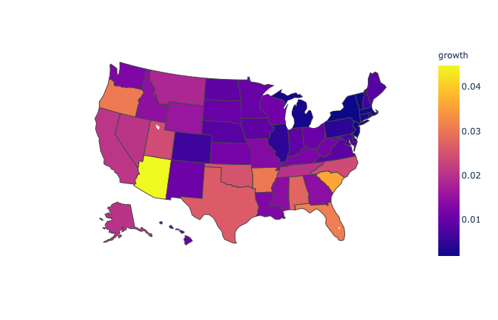
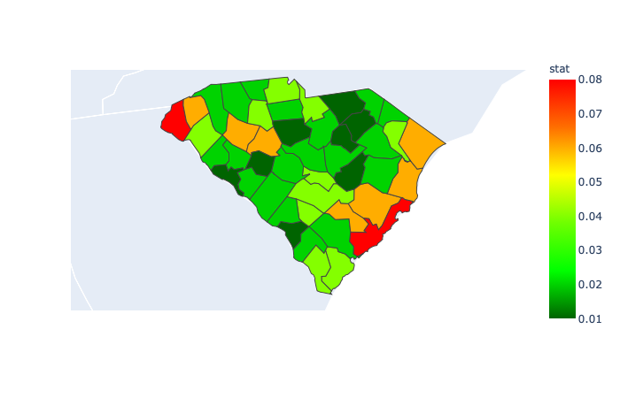
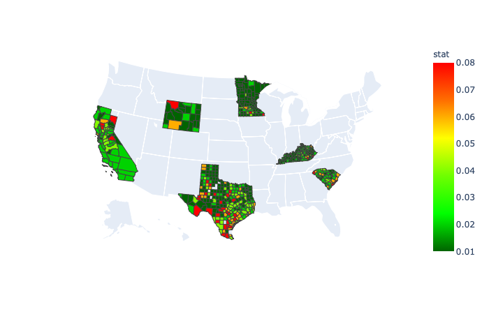

#### Parallel organization

After (yet another) restructuring, I believe we are approaching maturity.  

Analysis is launched from the main directory via ``analyze.py``.  I a few lines in my ``.zshrc``:

    covid_base=$HOME'/Dropbox/Github/covid'
    export covid_base
	
    alias cov='cd '$covid_base' && pwd'
    alias az='python3 analyze.py'

So I just open a Terminal and do

    > az SC -N 5 -sc 
                07/06 07/07 07/08 07/09 07/10 07/11 07/12
    Charleston    328    94   264   362   262   311   283
    Greenville    155    49   167   208   210   276   216
    Horry         235   130   169   189   172   208   208
    Richland       89    57    71   126   101   151   153
    Lexington      66    60    90    65    73    84   109
    >

Charleston County, SC added 283 new cases yesterday.

Other scripts are in the  ``build`` and ``maps`` directories.  The rest is utilities, in ``myutil``, and some tests, in ``test``.

The database is ``db``, and it comes in just the large size, for as many days back as there are files in the source.

The average script starts like this:

    base = os.environ.get('covid_base')
    if not base in sys.path:
        sys.path = [base] + sys.path
    util = base + '/myutil'
    if not util in sys.path:
        sys.path.insert(0, util)
    
    import ucalc, ufmt, ulabels, uinit, udb ..
    
Thus, you must set ``covid_base`` correctly in the environment.  Everything is specified as a path from ``covid_base``.

This can be done as a one-off by 

    covid_base=$HOME'/path/to/covid'

#### Command line arguments

These can be viewed with ``-h`` or ``--help`` with any script.

Features that are currently supported are given by the ``--help`` flag:

    > az -h
    
    flags
    -h  --help      help
    -n    <int>     display the last -n values, default: 7
    -N    <int>     display -N rows of data, default: 50
    -c    <int>     --delta, change from x days ago, default: 1
    
    -a  --all       use the complete db, starting 2020-03-22
    -d  --deaths    display deaths rather than cases (default)
    -f  --csv       format output as csv
    -o  --only      do not descend from say, US to states
    -p  --pop       normalize to population (this disables totals)
    -q  --quiet     silence output (for tests)
    -r  --rate      compute statistics (over last 7 days)
    -s  --sort      
    -t  --totals    (only)
    -v  --verbose   debugging mode
    
        --no_dates  suppress dates in row 1
        --counties  show US by counties
    
    to do:
    -g  --graph     plot a graph of the data
    -m  --map       make a choropleth map
    -u   <int>      data slice ends this many days before yesterday 
    
    example:
    python analyze.py -h -n 10 -sdr
    
    
    > 

Rather than use the built-in Python module for parsing the command line arguments (I find it too complicated), I rolled my own, see ``uinit.py``.

The statistic is the slope of a linear regression, divided by the mean of the values.  

So, for example, if a 10-day series goes smoothly from 100 to 110, then the slope is about 10/10 = 1 and the statistic is a bit less than 0.01.  If the series goes from 1000 to 1100, then the slope is about 100/10 = 10, but the statistic is still approximately 0.01.

#### General approach

The idea is to use the main part of the script to assemble the correct keys in order.  This list is passed to ``ucalc`` and then to ``ulabels`` and finally to ``ufmt`` along with the ``conf`` dictionary.

All the trimming, sorting and stats happens in ``ucalc``, label assembly from keys in ``ulabel``, and the output formatting in ``ufmt``.

The code about keys does not know which database we're using.  I found that too complicated to maintain since I added the option of building a ``max`` database.

So now the database is passed to ``ukeys`` functions as an argument.

(At the moment we're back to one giant database that gets trimmed during the load.  If you want the whole thing, pass ``--all``.  

#### Examples (as of 2020-07-09)

Let's go through the flags one by one.

    > p3 analyze.py -N 2
	             07/03 07/04 07/05 07/06 07/07 07/08 07/09
	Afghanistan  32022 32324 32672 32951 33190 33384 33594
	Albania       2662  2752  2819  2893  2964  3038  3106

The ``-N`` flag takes an integer modifier, and it cuts the number of rows to that value.  Since we did not provide a search term, we get the world.

    > p3 analyze.py SC -N 4 -n 4
	           07/06 07/07 07/08 07/09
	Abbeville    124   135   134   137
	Aiken        507   516   530   545
	Allendale     61    64    64    64
	Anderson     777   798   824   886
	>

We search for ``SC`` (South Carolina), and we change the default number of columns from 7 to 4.

    > p3 analyze.py SC -N 4 -n 4 -f
	,07/06,07/07,07/08,07/09
	Abbeville,124,135,134,137
	Aiken,507,516,530,545
	Allendale,61,64,64,64
	Anderson,777,798,824,886
	>

The ``-f`` flag asks to format as csv.  This is most useful for plotting programs.

Here's the US states:

	> p3 analyze.py US -N 5 -n 5
	             07/05  07/06  07/07  07/08  07/09
	Alabama      42359  43450  44375  45263  46424
	Alaska        1107   1134   1162   1180   1222
	Arizona      94567  98103 101455 105094 108614
	Arkansas     22322  22907  23288  23598  24301
	California  252895 264681 271035 284012 292560

We can add totals (for the whole US) with ``-t``:

	> p3 analyze.py US -N 5 -n 5 -t
	              07/05   07/06   07/07   07/08   07/09
	Alabama       42359   43450   44375   45263   46424
	Alaska         1107    1134    1162    1180    1222
	Arizona       94567   98103  101455  105094  108614
	Arkansas      22322   22907   23288   23598   24301
	California   252895  264681  271035  284012  292560
	total       2820368 2868846 2916232 2974609 3032316
	>

The ``-o`` flag limits the output to just the US

	> p3 analyze.py US -N 5 -n 5 -o
	      07/05   07/06   07/07   07/08   07/09
	US  2820368 2868846 2916232 2974609 3032316
	>

The ``-p`` flag normalizes to population.  

Not all locations have the population entered so this may fail.  All the US states are there, as well as countries of the EU.

	> p3 analyze.py US -N 5 -n 5 -p
	            07/05 07/06 07/07 07/08 07/09
	Alabama       863   886   905   923   946
	Alaska        151   155   158   161   167
	Arizona      1299  1347  1393  1443  1492
	Arkansas      739   759   771   781   805
	California    640   669   685   718   740
	> 

The ``-r`` flag computes a statistic and is most useful combined with ``-s`` for sort:

	> p3 analyze.py US -N 5 -n 5 -rs
	             07/05  07/06  07/07  07/08  07/09   stat
	Idaho         7369   7732   8051   8538   8968  0.049
	Texas       192153 194932 205642 216026 224929  0.042
	Montana       1167   1212   1249   1327   1371  0.041
	Florida     189851 199885 206217 213563 223532  0.039
	California  252895 264681 271035 284012 292560  0.036
	>

But sort will work without ``-r``

	> p3 analyze.py US -N 5 -n 5 -s 
	             07/05  07/06  07/07  07/08  07/09
	New York    396598 397131 397649 398237 398929
	California  252895 264681 271035 284012 292560
	Texas       192153 194932 205642 216026 224929
	Florida     189851 199885 206217 213563 223532
	New Jersey  172354 172717 172916 173196 173383
	>

We can use the ``-c`` flag to show the change from a previous time.  Most often, we would show the day-over-day change, but ``-c 10`` can give an estimate of active cases.

	> p3 analyze.py US -N 5 -n 5 -s -c 10
	            07/05 07/06 07/07 07/08 07/09
	Florida     80967 85997 83391 81157 82600
	California  56970 63569 64191 73428 77264
	Texas       64021 60374 65469 70132 74777
	Arizona     34377 34822 34796 34972 34695
	Georgia     21230 21651 21705 23054 24958
	>

And then finally, we might choose to look at deaths:

    > p3 analyze.py US -o -dc            
	    07/03 07/04 07/05 07/06 07/07 07/08 07/09
	US    676   697   242   268   345   959   824
	> 

There's more.

You can look at counties by passing the name ``counties``:

    > az counties -rs -N 10 -n 5
	             07/07 07/08 07/09 07/10 07/11  stat
	Pepin WI         1     2     4     5    14  0.558
	Scurry TX       71    71    84    90   321  0.407
	Dewey SD         9    12    27    33    33  0.303
	Mitchell KS      4     5     5    11    11  0.278
	Brooks TX       11    18    29    35    37  0.265
	Clark IL        15    18    21    36    40  0.262
	La Salle TX     24    41    51    68    76  0.252
	Cavalier ND      6     6    10    13    14  0.235
	Crockett TX     15    16    18    29    35  0.235
	Trimble KY       7     7     9    13    15  0.216
	>

##### Plots and maps

Results from ``plot_eu_us.py``

US v. EU new cases:

Choropleth 2020-06-19

and 2020-06-27

    python3 geo/one_state_map.py CA MN SC TX WY KY
    
