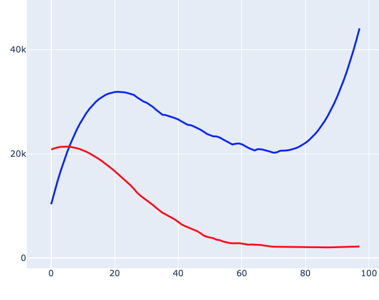

#### Parallel organization

The project is structured so that most scripts (except one) are in sub-directories, including ``analysis``, ``build`` and ``maps``.  

There is some in progress stuff like ``simulate``.

The rest is utilities, in ``myutil``, and ``test``.

The database is at main level, and it comes in in two sizes, one for as many days back as there are files at main level in the source, and the other with previous files stashed by month.

The average script starts like this:

    import sys, os, subprocess
    base = os.environ.get('covid_base')
    sys.path.insert(0,base)
    
Thus, you must set ``covid_base`` correctly.  Everything is specified as a path from ``covid_base``.

#### Command line arguments

These can be viewed with ``-h`` or ``--help`` with any script.

Features that are currently supported are given by the ``--help`` flag:

```
> python analyze.py --help


flags
-h  --help     help
-n    <int>    display the last -n values, default: 7
-N    <int>    display -N rows of data, default: no limit
-c    <int>    --delta, change from x days ago, default: 1

-a  --all      use the complete db, starting 2020-03-22
-d  --deaths   display deaths rather than the default, cases
-g  --graph    plot a graph of the data
-m  --map      make a choropleth map
-p  --pop      normalize to population
-r  --rate     compute statistics (currently, over last 7 days)
-s  --sort     
-t  --totals   (only)
-v  --verbose  debugging mode
-w, --write    text (if -g,-m present, output is normally silent)

to do:
-u   <int>    data slice ends this many days before yesterday 

example:
> python one_state.py <state> -n 10 -sdr
> 
```

I did not use the built-in Python module for parsing the command line arguments, but rolled my own, see ``uinit.py``

The statistic is the slope of a linear regression, divided by the mean of the values.  

So, for example, if a 10-day series goes smoothly from 100 to 110, then the slope is about 10/10 = 1 and the statistic is a bit less than 0.01.  If the series goes from 1000 to 1100, then the slope is about 100/10 = 10, but the statistic is still approximately 0.01.

#### Approach

The idea is to use the main part of the script to assemble the correct keys in order.  This list is passed to ``ucalc`` and then to ``ufmt`` along with the ``conf`` dictionary.

All the trimming, sorting and stats happens in ``ucalc``.

All the output formatting happens in ``ufmt``.

The code about keys does not know which database we're using.  I found that too complicated to maintain since I added the option of building a ``max`` database.  

So now the database is passed to ``ukeys`` functions as an argument.

#### Examples (as of 2020-07-09)

	python3 nalyze.py US -rs -N 3
	                   07/02   07/03   07/04   07/05   07/06   07/07   07/08
	Idaho               6592    6992    7369    7732    8051    8538    8968   0.05 
	Florida           168934  178407  189851  199885  206217  213563  223532   0.045
	Virgin Islands        92      98     111     111     112     116     122   0.042
	total            2720164 2775014 2820368 2868846 2916232 2974609 3032316   0.018
	
	
	running: 
	python3 analyze.py HI -rs
	               07/02 07/03 07/04 07/05 07/06 07/07 07/08
	Honolulu, HI     676   701   720   744   750   788   808 0.029
	Kauai, HI         38    38    40    40    40    42    42 0.018
	Hawaii, HI        90    91    93    93    94    95    96 0.01 
	Maui, HI         125   127   128   128   128   128   130 0.005
	total            929   957   981  1005  1012  1053  1076   0.024
	
	
	running: 
	python3 nalyze.py SC -N 3
	                07/02 07/03 07/04 07/05 07/06 07/07 07/08
	Abbeville, SC     119   118   119   124   135   134   137
	Aiken, SC         434   451   488   507   516   530   545
	Allendale, SC      58    58    58    61    64    64    64
	total           39701 41532 43386 44847 46380 47352 48909
	
	
	running: 
	python3 analyze.py Mexico -c -N 3
	                      07/02 07/03 07/04 07/05 07/06 07/07 07/08
	Aguascalientes           36    16    23     2    90    94   107
	Baja California         202   216   141    74    38   251   143
	Baja California Sur      53    49    64    40    27    86    40
	total                  6741  6740  6914  4683  4902  6258  6995
	
	
	running: 
	python3 Analyze.py Switzerland
	              07/02 07/03 07/04 07/05 07/06 07/07 07/08
	Switzerland   31967 32101 32198 32268 32315 32369 32498
	
	
	running: 
	python3 analyze.py Germany -N 3 -o
	           07/02  07/03  07/04  07/05  07/06  07/07  07/08
	Germany   195359 195817 196190 196413 196708 197071 197485

Results from ``plot_eu_us.py``

US v. EU new cases:



Choropleth 2020-06-19


and 2020-06-27


China new cases [2020-06-27](gallery/China 2020-06-27.txt).

    python3 geo/one_state_map.py CA MN SC TX WY KY
    
