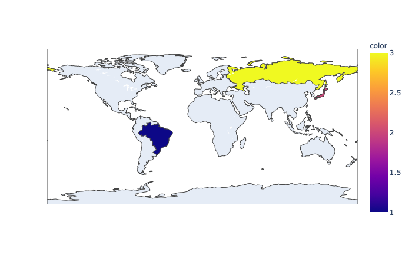
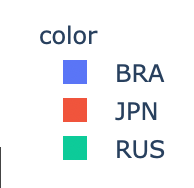
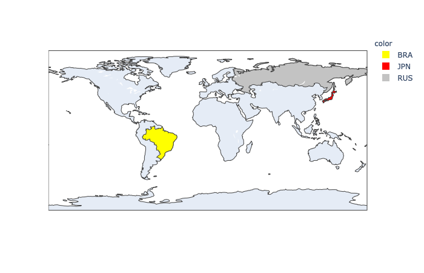
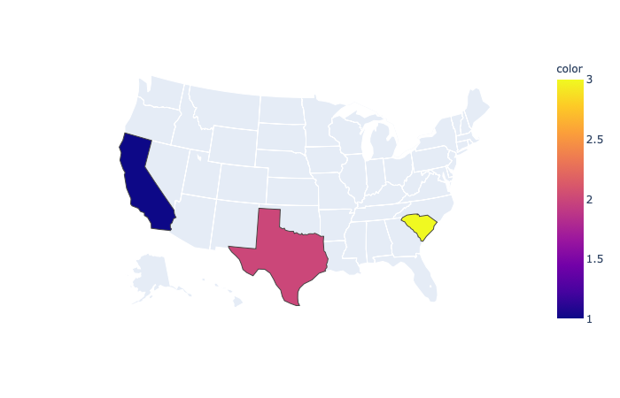
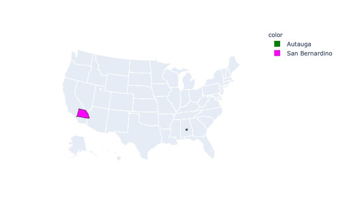

#### Introduction to plotly for Geo data

The plotly plotting library is open source.  You can obtain it with ``pip`` as in

     pip3 install plotly
     
(there are versions for R and javascript as well).

Then do ``python3`` and 

	 >>> import plotly
	 >>> plotly.__version__
	 '4.8.1'

There is also a high-level interface to plotly called ``plotly.express``.

``plotly.express`` comes with the GeoJSON data for world countries as well as U.S. states.  These must be keyed by their two-letter abbreviations for states, or by ISO- abbreviations for countries.  The latter are [here](https://en.wikipedia.org/wiki/List_of_ISO_3166_country_codes).

	 > python3       
	 ...
	 >>> import plotly.express as px
	 >>> L = ['BRA','JPN','RUS']
	 >>> fig = px.choropleth(locations=L,color=[1,2,3])
     >>> fig.show()

The result is:

The figure is html that is opened automatically in the browser.  It has buttons for zoom and pan, and to save as png.

#### colors

The ``color`` argument isn't necessary, in that case the specified countries are colored the same default color, a medium blue.

In the example above, we obtained the colors as a ``color_continuous_scale``.  The default one [appears](https://plotly.com/python/builtin-colorscales/) to be Inferno.

How this works is that if the colors are given as numerical data, then the values are converted to the range [0,1].  Then the colors of the color scale are mapped to the same range, and the appropriate colors interpolated from the values.

Here we provided ``[1,2,3]`` and these values were mapped to ``[0,0.5,1]``.  The first, middle and last colors were obtained from the color scale Plasma.

    >>> print(px.colors.sequential.Plasma)
    ['#0d0887', '#46039f', '#7201a8', '#9c179e', '#bd3786', '#d8576b', '#ed7953', '#fb9f3a', '#fdca26', '#f0f921']

So the middle value would be interpolated between ``'#bd3786'`` and ``'#d8576b'``.

Another way to do this is to give categorical data for the colors.  For example we could do:

	 >>> fig = px.choropleth(locations=L,color=L)

We'd get these colors:

It's nicer to specify the colors you want. 

Available named colors are [here](https://community.plotly.com/t/plotly-colours-list/11730/2).

Including CSS colors, other defaults are:

    '#1f77b4',  # muted blue
    '#ff7f0e',  # safety orange
    '#2ca02c',  # cooked asparagus green
    '#d62728',  # brick red
    '#9467bd',  # muted purple
    '#8c564b',  # chestnut brown
    '#e377c2',  # raspberry yogurt pink
    '#7f7f7f',  # middle gray
    '#bcbd22',  # curry yellow-green
    '#17becf'   # blue-tea

So

	>>> cL = ['yellow','red',"rgb(195, 195, 195)"]
	>>> fig = px.choropleth(locations=L,color=L,color_discrete_sequence=cL)
	>>> fig.show()

#### focus on a region

The second example is a [script](intro1.py).  The script uses two new arguments to the choropleth constructor:

- ``locationmode="USA-states"``
- ``scope='usa'``

That location mode enables the use of the two-letter abbreviations for states.  

The scope argument limits the display to the USA.  Other possible values include the different continents.

#### Using other GeoJSON data

The third example is anothe [script](intro2.py).  

The script imports the GeoJSON data for US counties.  I got it from the plotly github repo and saved it to disk to reuse.

It's in JSON format.

We can pick out individual FIPS values to restrict which counties are drawn.  Their examples use a pandas data frame.  I haven't yet figured out how to avoid that, so we construct a short data frame with

        fips  value
	0  01001      1
	1  06071      2

The first value is Autauga County in Alabama, and the second is the largest county in the United States, San Bernardino County in California.

The choropleth is constructed with this call:

	fig = px.choropleth(
	    df,
	    geojson=counties,
	    locations='fips',
	    color=["Autauga","San Bernardino"],
	    color_discrete_sequence=cL,
	    scope='usa')
    

We pass in the data frame, the GeoJSON data (all of it) and then 

    locations='fips',
	 color='value'
	 
What this does is to tell px to match a county from the GeoJSON data (by the default, it is ``'id'``) against the value in column one of the data frame, a ``'fips'``.

That county is then plotted and colored according to the corresponding value in the second column.

Since the values are categorical, they are matched against the colors from the ``color_discrete_sequence``:

    cL = ['green','magenta']

